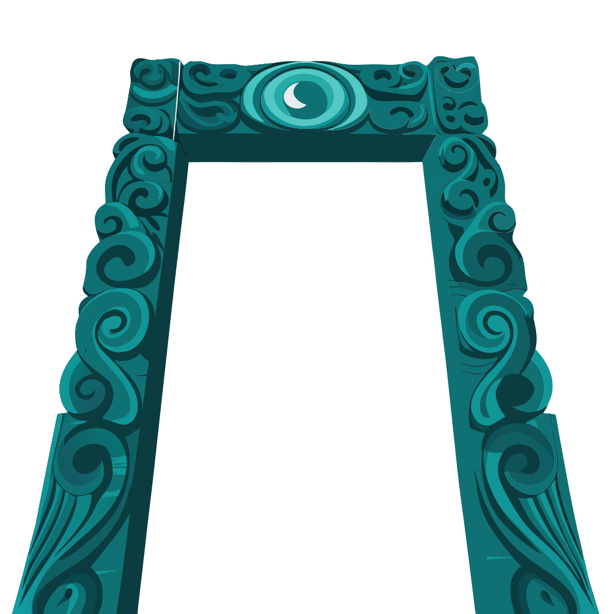
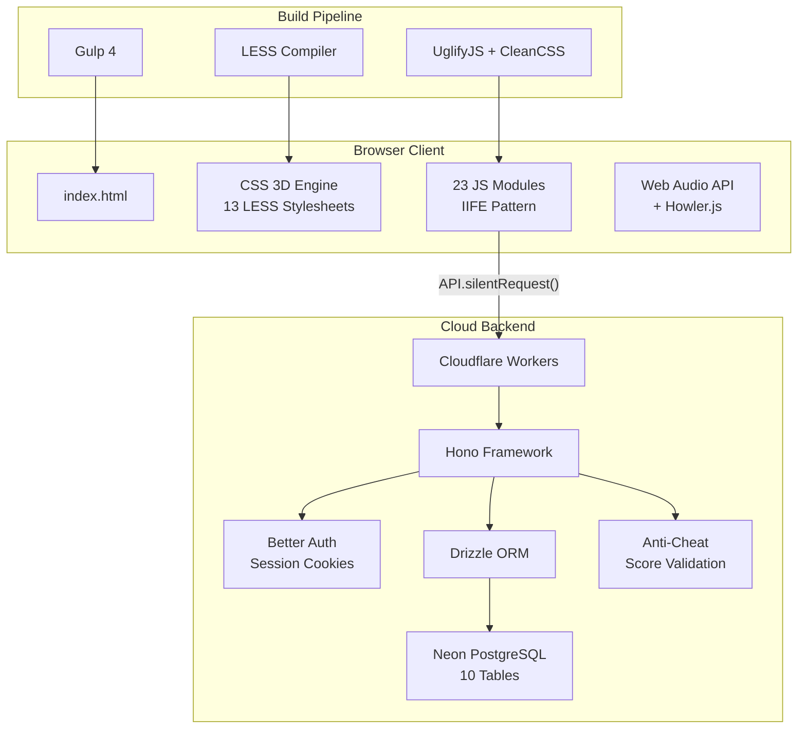
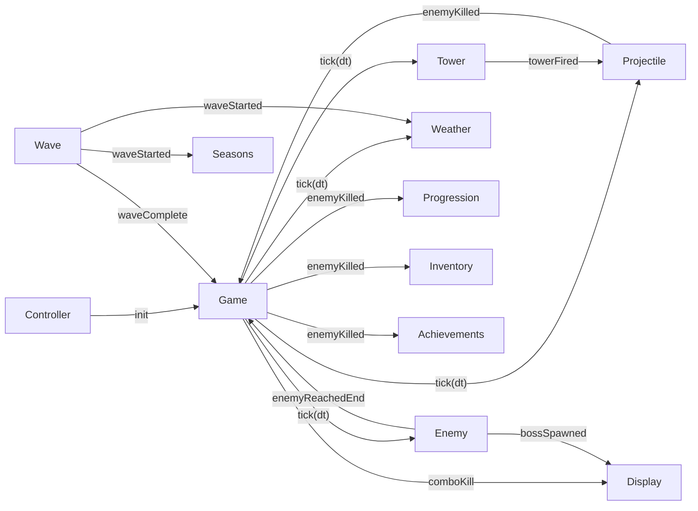

<div align="center"><a name="readme-top"></a>



# Te Pa Tiaki — CSS Tower Defense<br/><h3>Guardians of Aotearoa</h3>

A 3D tower defense game rendered entirely with CSS 3D transforms and vanilla JavaScript.<br/>
No Canvas, no WebGL, no game engine — just pure CSS and DOM elements in a 45-degree isometric world.<br/>
Themed around Maori mythology with cloud saves, leaderboards, and daily challenges.

<br/>

<p align="center">
  <a href="https://chanmeng666.github.io/css-tower-defense/">
    
  </a>
</p>

<br/>

[](https://chanmeng666.github.io/css-tower-defense/)


<br/>

[](https://github.com/ChanMeng666/css-tower-defense/stargazers)
[](https://github.com/ChanMeng666/css-tower-defense/forks)
[](https://github.com/ChanMeng666/css-tower-defense/issues)
[](https://github.com/ChanMeng666/css-tower-defense/commits/main)

<br/>

**Tech Stack**


<br/><br/>

**Share This Project**

[](https://x.com/intent/tweet?hashtags=css3d,gamedev,opensource&text=Check%20out%20Te%20Pa%20Tiaki%20%E2%80%94%20a%203D%20tower%20defense%20game%20built%20entirely%20with%20CSS%20transforms!&url=https%3A%2F%2Fgithub.com%2FChanMeng666%2Fcss-tower-defense)
[](https://t.me/share/url?text=A%203D%20tower%20defense%20game%20built%20with%20pure%20CSS%20transforms&url=https%3A%2F%2Fgithub.com%2FChanMeng666%2Fcss-tower-defense)
[](https://api.whatsapp.com/send?text=Check%20out%20this%20CSS%203D%20tower%20defense%20game%20https%3A%2F%2Fgithub.com%2FChanMeng666%2Fcss-tower-defense)
[](https://www.reddit.com/submit?title=Te%20Pa%20Tiaki%20%E2%80%94%20CSS%203D%20Tower%20Defense&url=https%3A%2F%2Fgithub.com%2FChanMeng666%2Fcss-tower-defense)
[](https://linkedin.com/sharing/share-offsite/?url=https://github.com/ChanMeng666/css-tower-defense)

</div>

> [!IMPORTANT]
> Every tower, enemy, projectile, and particle in this game is a DOM element styled with CSS 3D transforms. There is no `<canvas>`, no WebGL, and no game engine — the entire 3D isometric world is rendered by the browser's CSS engine. The game features Maori mythology theming, a full cloud backend, daily challenges, crafting, and progression systems.

<details>
<summary><kbd>Table of Contents</kbd></summary>

#### TOC

- [Introduction](#-introduction)
- [Key Features](#-key-features)
- [Tech Stack](#%EF%B8%8F-tech-stack)
- [Architecture](#%EF%B8%8F-architecture)
- [Getting Started](#-getting-started)
- [How to Play](#-how-to-play)
- [Game Guide](#-game-guide)
  - [Tower Guide](#tower-guide)
  - [Enemy Bestiary](#enemy-bestiary)
  - [Environmental Systems](#environmental-systems)
  - [Progression and Economy](#progression-and-economy)
- [Deployment](#-deployment)
- [API Reference](#-api-reference)
- [Contributing](#-contributing)
- [License](#-license)
- [Author](#%EF%B8%8F-author)

####

<br/>

</details>

<!-- ═══════════════════════════════════════════════════════════════════════════ -->

## Introduction

<table>
<tr>
<td>

**Te Pa Tiaki** (The Protective Fortress) is a tower defense game where the entire 3D world is rendered using CSS 3D transforms. Every game object — towers, enemies, projectiles, explosions, weather particles — is a real DOM element positioned and rotated in 3D space using `transform-style: preserve-3d` and CSS transforms at a 45-degree isometric perspective.

The game is themed around **Maori mythology and culture of Aotearoa** (New Zealand). Towers are named after Maori weapons and atua (deities) — Taiaha, Mere, Tangaroa, Tohunga, Tawhiri, Mahuika. Enemies draw from Maori legends — Kehua (spirits), Patupaiarehe (fairy folk), Toa (warriors), Wairua (ethereal ghosts), Tipua (supernatural giants), and the mighty Taniwha (water guardians). Materials are taonga (treasures) — Pipi, Koiwi, and Pounamu.

Beyond the core tower defense gameplay, the project includes a full **cloud backend** powered by Cloudflare Workers with authentication, leaderboards, cloud saves, daily challenges, and progression sync — while preserving a fully functional **guest mode** that works without an account.

</td>
</tr>
</table>

> [!NOTE]
> - Chrome recommended (hardware acceleration for best CSS 3D performance)
> - Works in Firefox, Safari, and Edge
> - No account required — guest mode is fully supported

<div align="right">

[](#readme-top)

</div>

<!-- ═══════════════════════════════════════════════════════════════════════════ -->

## Key Features

### `1` CSS 3D Rendering Engine

Every visual element is a styled DOM node — no Canvas, no WebGL. The game uses CSS 3D transforms to create a full isometric 3D world with a Comic / Pop-Art visual style.

- **Pure CSS 3D** — All objects rendered with `transform-style: preserve-3d`, 45-degree isometric perspective at 1200px
- **Comic / Pop-Art Style** — Halftone dot patterns, hard-offset pop shadows, thick comic borders, warm palette (#FFF8F0)
- **Object Pooling** — DOM element reuse via `Pool.acquire()`/`Pool.release()` for smooth 60fps performance
- **Dynamic Theming** — CSS custom properties driven by JavaScript for day/night, weather, and seasonal palette transitions
- **All CSS Shapes** — Towers, enemies, and icons built with `clip-path`, `border-radius`, and pseudo-elements — no emoji, no images

<div align="right">

[](#readme-top)

</div>

### `2` Maori-Themed Gameplay

Towers, enemies, materials, and abilities all draw from te reo Maori and Maori mythology, creating an authentic cultural experience.

**6 Towers** named after Maori weapons and atua:

| Tower | Meaning | Role |
|-------|---------|------|
| **Taiaha** | Traditional fighting staff | Fast single-target archer |
| **Mere** | Pounamu greenstone club | Splash damage cannon |
| **Tangaroa** | Ocean deity | Slowing ice tower |
| **Tohunga** | Spiritual leader | Armor-piercing magic |
| **Tawhiri** | Storm god | Chain lightning |
| **Mahuika** | Fire goddess | Damage-over-time flames |

**6 Enemies** from Maori mythology:

| Enemy | Meaning | Special |
|-------|---------|---------|
| **Kehua** | Wandering spirits | Basic |
| **Patupaiarehe** | Fairy folk | Fast |
| **Toa** | Warriors | Armored |
| **Wairua** | Ethereal spirits | Stealth phases |
| **Tipua** | Supernatural giants | Trample stun |
| **Taniwha** | Water guardians | Boss with 3 skills |

**3 Maps**: Te Awa (The River), Te Maunga (The Mountain), Te Moana (The Ocean)

<div align="right">

[](#readme-top)

</div>

### `3` Combat and Deep Systems

- **Boss Skills** — Taniwha boss uses Karanga (summon minions), Kaitiaki (shield), Te Riri (enrage)
- **Tower Synergies** — Adjacent tower combos: Freeze Lightning, Fire Blast, Blessing, Array
- **Reforging** — Terraria-inspired random prefixes from Common to Legendary rarity
- **Combo System** — Chain kills within 1.5s for escalating gold bonuses
- **Mana Abilities** — Active ability system with cooldowns
- **Critical Hits** — Chance-based bonus damage with visual feedback
- **4 Enemy Variants** — Rangatira (elite), Pakanga (armored), Tere (swift), Mate (deadly)

### `*` Additional Features

- [x] **10 Progressive Waves** with 3 difficulty modes (Normal, Hard, Expert)
- [x] **Endless Mode** to keep playing beyond wave 10
- [x] **Day/Night Cycle** tied to waves with weather and seasonal effects
- [x] **Blood Moon** night events with escalating probability
- [x] **XP and Tech Tree** with 10 upgrades and skill points
- [x] **Inventory and Loot** — Terraria-inspired material drops (Pipi, Koiwi, Pounamu)
- [x] **Crafting System** — 6 consumable recipes from gathered materials
- [x] **Daily Challenges** — 20+ templates across 6 categories with score bonuses
- [x] **Achievement System** — Combat, progression, and challenge categories with gold rewards
- [x] **Cloud Backend** — Auth, leaderboard, cloud saves (3 slots), stats tracking
- [x] **Anti-Cheat** — Server-side score validation
- [x] **Interactive Tutorial** — 4-step onboarding with spotlight highlights for new players
- [x] **Dynamic Music** — Music adapts to game state (menu, playing, boss, victory, defeat)
- [x] **Synthesized Audio** — Web Audio API synth effects + Howler.js for music and samples
- [x] **Keyboard Shortcuts** — 1-6 for tower selection, Space for wave, Esc for pause
- [x] **Settings Panel** — Volume control persisted to localStorage

<div align="right">

[](#readme-top)

</div>

<!-- ═══════════════════════════════════════════════════════════════════════════ -->

## Tech Stack

<div align="center">
  <table>
    <tr>
      <td align="center" width="96">
        
        <br>CSS 3D
      </td>
      <td align="center" width="96">
        
        <br>ES6
      </td>
      <td align="center" width="96">
        
        <br>LESS
      </td>
      <td align="center" width="96">
        
        <br>Gulp 4
      </td>
      <td align="center" width="96">
        
        <br>Workers
      </td>
      <td align="center" width="96">
        
        <br>Neon DB
      </td>
      <td align="center" width="96">
        
        <br>Hono
      </td>
    </tr>
  </table>
</div>

| Layer | Technology | Purpose |
|-------|-----------|---------|
| **Rendering** | CSS 3D Transforms | Isometric 3D game world, all visual elements |
| **Logic** | Vanilla JavaScript (ES6) | Game loop, AI, physics — IIFE modules with event-driven communication |
| **Styling** | LESS | Variables, mixins, dynamic theming (13 stylesheets) |
| **Build** | Gulp 4 | Script concatenation, LESS compilation, minification |
| **Audio** | Web Audio API + Howler.js | Synthesized SFX + music/sample playback |
| **Backend** | Cloudflare Workers | Serverless edge compute |
| **Framework** | Hono | Lightweight HTTP router for Workers |
| **Database** | Neon DB (PostgreSQL) | Serverless PostgreSQL via `@neondatabase/serverless` |
| **ORM** | Drizzle ORM | Type-safe database queries and migrations |
| **Auth** | Better Auth | Session cookie authentication |
| **Validation** | Zod | Runtime schema validation |
| **CI/CD** | GitHub Actions | Automatic deployment on push to main |

<div align="right">

[](#readme-top)

</div>

<!-- ═══════════════════════════════════════════════════════════════════════════ -->

## Architecture

<table>
<tbody>
<tr></tr>
<tr>
<td width="10000">
<details>

<summary>&nbsp;&nbsp;<strong>System Architecture</strong></summary><br>



</details>
</td>
</tr>
<tr></tr>
<tr>
<td width="10000">
<details>

<summary>&nbsp;&nbsp;<strong>Event-Driven Game Loop</strong></summary><br>

All game systems communicate via `CustomEvent` dispatch on `document` using `emitGameEvent()`:



Key events: `enemyKilled`, `waveStarted`, `waveComplete`, `towerPlaced`, `towerFired`, `bossSpawned`, `bossPhaseChange`, `weatherChanged`, `seasonChanged`, `comboKill`, `authStateChanged`

</details>
</td>
</tr>
<tr></tr>
<tr>
<td width="10000">
<details>

<summary>&nbsp;&nbsp;<strong>Project Structure</strong></summary><br>

```
css-tower-defense/
├── index.src.html          # Source HTML template (Gulp injects scripts/styles)
├── index.html              # Built HTML (generated)
├── gulpfile.js             # Build configuration + script load order
├── package.json
├── CLAUDE.md               # AI assistant guidance
├── .github/
│   └── workflows/
│       └── deploy.yml      # GitHub Actions CI/CD pipeline
├── styles/
│   ├── app.less            # Entry point (imports all LESS files)
│   ├── vars.less           # Variables, mixins, keyframes
│   ├── game.less           # UI, screens, menus, HUD
│   ├── map.less            # Map grid, environment, sky
│   ├── tower.less          # Tower 3D models
│   ├── enemy.less          # Enemy 3D models
│   ├── projectile.less     # Projectile effects
│   ├── effects.less        # Particle effects, explosions
│   ├── effects-fire.less   # Fire/flame tower effects
│   ├── effects-weather.less# Rain, snow, fog, wind effects
│   ├── auth.less           # Auth modal styles
│   └── loading.less        # Loading screen styles
├── scripts/
│   ├── utils.js            # Utility functions (throttle, lerp, distance)
│   ├── pool.js             # DOM element pooling
│   ├── noise.js            # Perlin noise generator
│   ├── effects.js          # Visual effects manager, FPS monitoring
│   ├── path.js             # Grid/pathfinding (12x8 grid)
│   ├── weather.js          # Day/night cycle, weather effects
│   ├── seasons.js          # Seasonal themes and modifiers
│   ├── auth.js             # Auth UI + session management
│   ├── api.js              # Backend API client
│   ├── challenge.js        # Daily challenge system
│   ├── progression.js      # XP, leveling, tech tree
│   ├── inventory.js        # Inventory/loot system
│   ├── crafting.js         # Consumable crafting from materials
│   ├── enemy.js            # Enemy AI, variants, boss skills
│   ├── tower.js            # Tower mechanics, upgrades, reforging, synergies
│   ├── projectile.js       # Projectile physics
│   ├── wave.js             # Wave spawning (10 waves + endless)
│   ├── display.js          # UI updates, announcements, damage numbers
│   ├── shop.js             # Tower shop UI
│   ├── sfx.js              # Web Audio API synth + Howler.js
│   ├── game.js             # Main game loop, state management, combo system
│   ├── achievements.js     # Achievement system
│   └── controller.js       # Input handling, initialization entry point
├── worker/                 # Cloudflare Worker backend
│   ├── wrangler.toml       # Worker configuration
│   ├── drizzle.config.ts   # Drizzle ORM config
│   ├── drizzle/            # Database migrations
│   └── src/
│       ├── index.ts        # Hono app, route mounting, CORS
│       ├── db/
│       │   ├── index.ts    # Neon serverless connection
│       │   └── schema.ts   # Drizzle table definitions (10 tables)
│       ├── middleware/
│       │   └── auth.ts     # requireAuth middleware
│       ├── routes/
│       │   ├── auth.ts     # Better Auth catch-all
│       │   ├── leaderboard.ts
│       │   ├── saves.ts    # Save/load (3 slots)
│       │   ├── progression.ts
│       │   ├── challenges.ts # Daily challenge scoring
│       │   └── stats.ts    # Game history, achievements
│       └── services/
│           ├── anticheat.ts    # Score validation
│           └── pending-scores.ts # Async score processing
├── assets/
│   ├── images/             # SVG logos
│   └── sfx/                # Sound effects and music
│       ├── blasts/         # Explosion sounds
│       ├── effects/        # UI and game SFX
│       └── musics/         # Background music tracks
├── vendor/
│   ├── prefixfree.min.js   # CSS prefix-free
│   └── howler.min.js       # Audio library
└── dist/                   # Production build output
```

</details>
</td>
</tr>
</tbody>
</table>

<div align="right">

[](#readme-top)

</div>

<!-- ═══════════════════════════════════════════════════════════════════════════ -->

## Getting Started

### Prerequisites

> [!IMPORTANT]
> Ensure you have the following installed:

- Node.js 18.0+ ([Download](https://nodejs.org/))
- npm (included with Node.js)

### Quick Installation

```bash
# Clone the repository
git clone https://github.com/ChanMeng666/css-tower-defense.git
cd css-tower-defense

# Install dependencies
npm install

# Build the project
npm run build
```

### Running Locally

Open `index.html` in a modern browser, or use a local server:

```bash
python -m http.server 8080
# or
npx serve
```

### Development Mode

```bash
npm run watch    # Watch mode (auto-rebuild on file changes)
npm run build    # Development build (unminified)
npm run compile  # Production build (minified output in dist/)
npm run dev      # Concurrent frontend watch + backend dev server
```

### Backend Development

```bash
# Set up Wrangler secrets
cd worker && npx wrangler secret put DATABASE_URL
cd worker && npx wrangler secret put BETTER_AUTH_SECRET

# Database commands
npm run db:generate   # Generate Drizzle migrations
npm run db:migrate    # Run migrations
npm run db:studio     # Open Drizzle Studio

# Deploy backend + frontend
npm run deploy        # Compiles frontend + deploys worker
```

<div align="right">

[](#readme-top)

</div>

<!-- ═══════════════════════════════════════════════════════════════════════════ -->

## How to Play

1. **Choose Map and Difficulty** — Select from 3 maps and 3 difficulty modes on the start screen
2. **Select a Tower** — Click a tower type in the shop panel (or press `1`-`6`)
3. **Place Tower** — Click on a grass cell to place it
4. **Start Wave** — Press `Space` or click "Start Wave"
5. **Defend** — Towers automatically attack enemies in range
6. **Upgrade and Reforge** — Click placed towers to upgrade (3 levels) or reforge for random prefixes
7. **Collect Loot** — Enemies drop Pipi, Koiwi, and Pounamu materials
8. **Craft Consumables** — Use materials to craft buffs and shields
9. **Earn XP** — Level up and spend skill points in the tech tree
10. **Save Progress** — Press `F5` to quick-save, `F9` to quick-load (3 cloud slots when logged in)
11. **Survive** — Don't let enemies reach the end of the path!

### Controls

| Key | Action |
|-----|--------|
| `1`-`6` | Quick-select tower types |
| `Space` | Start next wave |
| `Esc` | Deselect tower / Close panels / Pause |
| `Click` | Place tower / Select placed tower |
| `F5` | Quick save |
| `F9` | Quick load |

> [!TIP]
> First-time players will see an interactive 4-step tutorial with spotlight highlights guiding them through tower placement and wave management.

<div align="right">

[](#readme-top)

</div>

<!-- ═══════════════════════════════════════════════════════════════════════════ -->

## Game Guide

<table>
<tbody>
<tr></tr>
<tr>
<td width="10000">
<details open>

<summary>&nbsp;&nbsp;<strong>Tower Guide</strong></summary><br>

| Tower | Cost | Damage | Range | Fire Rate | Special |
|-------|------|--------|-------|-----------|---------|
| **Taiaha** (Fighting Staff) | 50g | 15 | 120px | 2.0/s | Fast single-target attacks |
| **Mere** (Greenstone Club) | 100g | 30 | 150px | 0.8/s | 60px splash radius |
| **Tangaroa** (Ocean Deity) | 75g | 10 | 100px | 1.5/s | 50% slow for 2s |
| **Tohunga** (Spiritual Leader) | 150g | 50 | 200px | 0.5/s | Ignores armor |
| **Tawhiri** (Storm God) | 200g | 40 | 140px | 2.5/s | Chains to 3 targets (70% falloff) |
| **Mahuika** (Fire Goddess) | 250g | 5 | 100px | 10/s | Burn: 3 dmg/0.5s for 3s |

**Upgrades:** Each tower can be upgraded to level 3 (+50% damage, +10% range, -10% cooldown per level). Upgrade cost: `floor(baseCost * 0.75 * level)`. Sell value: 60% of total invested cost.

**Reforging:** Towers can be reforged for random prefixes at 50% base cost:

| Prefix | Rarity | Effect |
|--------|--------|--------|
| Swift | Common (60%) | +15% fire rate |
| Deadly | Common | +20% damage |
| Keen | Common | +10% range |
| Arcane | Rare (25%) | +25% range |
| Fierce | Rare | +25% damage, +5% fire rate |
| Rapid | Rare | +25% fire rate |
| Mythical | Epic (12%) | +15% damage, +10% fire rate, +10% range |
| Godly | Epic | +30% damage, +15% range |
| Legendary | Legendary (3%) | +25% damage, +25% fire rate, +25% range |

**Synergies:** Place towers adjacent to each other for combo bonuses:

| Synergy | Towers | Effect |
|---------|--------|--------|
| Freeze Lightning | Tangaroa + Tawhiri | Tawhiri deals +25% damage to slowed enemies |
| Fire Blast | Mere + Mahuika | Cannon splash triggers burning |
| Blessing | Tohunga + any | Adjacent towers +15% attack speed |
| Array | Same type x2+ | Same-type towers +10% range (max 3x) |

</details>
</td>
</tr>
<tr></tr>
<tr>
<td width="10000">
<details open>

<summary>&nbsp;&nbsp;<strong>Enemy Bestiary</strong></summary><br>

| Enemy | Health | Speed | Reward | Armor | Special |
|-------|--------|-------|--------|-------|---------|
| **Kehua** (Spirit) | 50 | 40 px/s | 10g | 0 | -- |
| **Patupaiarehe** (Fairy) | 80 | 60 px/s | 15g | 0 | -- |
| **Toa** (Warrior) | 200 | 30 px/s | 25g | 5 | Armored |
| **Wairua** (Ghost) | 40 | 50 px/s | 20g | 0 | Stealth phases (only Tohunga can target) |
| **Tipua** (Giant) | 500 | 15 px/s | 50g | 8 | 10% chance to trample/stun towers |
| **Taniwha** (Boss) | 1000 | 20 px/s | 100g | 10 | 3 boss skills (see below) |

**Taniwha Boss Skills:**
- **Karanga** (The Call) — 10s cooldown: Summons 3 Kehua minions
- **Kaitiaki** (Guardian Shield) — 15s cooldown: +50 armor for 5s, only below 70% HP
- **Te Riri** (The Rage) — Once at 30% HP: +50% speed, 2x damage permanently

**Enemy Variants** (Maori terms):

| Variant | Health | Speed | Reward | Damage | Armor |
|---------|--------|-------|--------|--------|-------|
| **Rangatira** (Chief) | 2.0x | 1.3x | 2.5x | 1.5x | -- |
| **Pakanga** (Battle-ready) | 1.5x | 0.8x | 1.8x | 1.0x | +10 |
| **Tere** (Swift) | 0.7x | 2.0x | 1.5x | 1.0x | -- |
| **Mate** (Deadly) | 1.2x | 1.0x | 2.0x | 2.0x | -- |

</details>
</td>
</tr>
<tr></tr>
<tr>
<td width="10000">
<details>

<summary>&nbsp;&nbsp;<strong>Environmental Systems</strong></summary><br>

**Day / Night Cycle:**
Tied to waves — odd waves are daytime (sun at 90 degrees), even waves are nighttime (270 degrees). Night uses warm navy `#1A2A3A` sky with 3s CSS transitions.

**Seasons:**

| Waves | Season | Effect |
|-------|--------|--------|
| 1-2 | Summer | Baseline |
| 3-4 | Autumn | Seasonal modifiers |
| 5-6 | Winter | Seasonal modifiers |
| 7-8 | Spring | Seasonal modifiers |
| 9-10 | Summer | Seasonal modifiers |

Each season changes the map's color palette (grass, path, sky) via CSS custom properties and provides tower/gold modifiers.

**Weather:**
Randomly selected each wave based on seasonal weights: Clear, Rain, Fog, Wind, Snow, Heat Wave. Each type applies gameplay modifiers to tower range, enemy speed, and gold income.

**Blood Moon:**
Night-only event (even waves) with probability = `waveNumber * 2.5%`. Overrides normal night modifiers with enhanced enemy stats.

</details>
</td>
</tr>
<tr></tr>
<tr>
<td width="10000">
<details>

<summary>&nbsp;&nbsp;<strong>Progression and Economy</strong></summary><br>

**Tech Tree** — Earn XP from kills (`reward * 2`) and wave completions. XP per level: `floor(100 * 1.5^(level-1))`.

| Upgrade | Effect per Level | Max Level | Cost |
|---------|-----------------|-----------|------|
| Budget Engineering | -10% tower cost | 3 | 1 SP |
| Trust Fund | +50 starting gold | 3 | 1 SP |
| Heavy Rounds | +10% tower damage | 3 | 2 SP |
| Rapid Fire | +10% attack speed | 3 | 2 SP |
| Eagle Eye | +10% tower range | 3 | 1 SP |
| Lucky Shot | +5% crit chance | 3 | 2 SP |
| Greed | +15% gold from kills | 3 | 2 SP |
| Deep Freeze | +20% slow duration | 2 | 2 SP |
| Blast Radius | +20% splash range | 2 | 2 SP |
| Reinforcements | +5 starting lives | 2 | 3 SP |

**Materials** (Terraria-inspired drops):

| Material | Rarity | Source |
|----------|--------|--------|
| **Pipi** (Shell) | Common | All enemies (10-20%) |
| **Koiwi** (Carved Bone) | Rare | Patupaiarehe+ (1-5%) |
| **Pounamu** (Greenstone) | Epic | Toa+ (0-1%), Taniwha (100%) |

Variant enemies have increased drop rates (1.2x-2.0x multipliers).

**Crafting Recipes:**

| Recipe | Effect | Cost |
|--------|--------|------|
| **Kiri Rino** (Iron Skin) | +3 lives (permanent) | 5 Pipi |
| **Ihi Nui** (Great Power) | +25% tower damage (1 wave) | 3 Koiwi |
| **Mahana Rere** (Freezing Flight) | Enemies 30% slower (1 wave) | 2 Pipi + 1 Koiwi |
| **Koura Kukume** (Gold Magnet) | +50% gold (1 wave) | 3 Pipi + 2 Koiwi |
| **Pounamu Tiaki** (Greenstone Shield) | Block next 3 hits | 1 Pounamu + 2 Pipi |
| **Karakia Tere** (Swift Incantation) | +50% attack speed (1 wave) | 2 Pounamu + 1 Koiwi |

**Difficulty Modes:**

| Mode | Enemy HP | Enemy Dmg | Gold | XP |
|------|----------|-----------|------|----|
| Normal | 1.0x | 1.0x | 1.0x | 1.0x |
| Hard | 1.5x | 1.5x | 1.3x | 1.5x |
| Expert | 2.0x | 2.0x | 1.5x | 2.0x |

**Starting Resources:** 100 gold (+ Progression bonus), 20 lives (+ Progression bonus)

**Combo System:** 1.5s timeout between kills. Minimum 3 kills for bonus. 10% extra gold per kill in combo + `comboCount * 5` end-of-combo bonus.

</details>
</td>
</tr>
</tbody>
</table>

<div align="right">

[](#readme-top)

</div>

<!-- ═══════════════════════════════════════════════════════════════════════════ -->

## Deployment

### Frontend

The frontend is deployed to **GitHub Pages** via GitHub Actions. On every push to `main`, the CI pipeline compiles the production build and deploys `dist/` automatically.

### Backend

The backend runs on **Cloudflare Workers** and deploys via Wrangler:

```bash
# Set secrets (one-time)
cd worker && npx wrangler secret put DATABASE_URL
cd worker && npx wrangler secret put BETTER_AUTH_SECRET

# Deploy (compiles frontend + deploys worker)
npm run deploy
```

### Environment Variables

| Variable | Required | Purpose |
|----------|----------|---------|
| `DATABASE_URL` | Yes | Neon PostgreSQL connection string |
| `BETTER_AUTH_SECRET` | Yes | Auth session encryption key |

### Database

10 tables managed by Drizzle ORM: `user`, `session`, `account`, `verification` (Better Auth), `profiles`, `leaderboard_entries`, `game_saves`, `progression`, `achievements`, `game_history`.

```bash
npm run db:generate   # Generate migration files
npm run db:migrate    # Apply migrations to database
npm run db:studio     # Visual database browser
```

<div align="right">

[](#readme-top)

</div>

<!-- ═══════════════════════════════════════════════════════════════════════════ -->

## API Reference

> [!NOTE]
> Guest mode is fully preserved — API calls silently return null when not logged in.

| Method | Path | Auth | Description |
|--------|------|------|-------------|
| `GET` | `/api/health` | No | Health check |
| `ALL` | `/api/auth/*` | No | Better Auth (sign-up, sign-in, sign-out) |
| `GET` | `/api/leaderboard` | No | Public leaderboard (filterable by difficulty) |
| `GET` | `/api/leaderboard/me` | Yes | My rank and nearby entries |
| `POST` | `/api/leaderboard` | Yes | Submit score (anti-cheat validated) |
| `GET` | `/api/saves` | Yes | Get all 3 save slots |
| `PUT` | `/api/saves/:slot` | Yes | Save to slot 0-2 |
| `DELETE` | `/api/saves/:slot` | Yes | Delete save slot |
| `GET` | `/api/progression` | Yes | Get progression data |
| `PUT` | `/api/progression` | Yes | Save progression |
| `POST` | `/api/progression/sync` | Yes | Merge local + server data |
| `POST` | `/api/stats/game` | Yes | Record completed game |
| `GET` | `/api/stats/me` | Yes | My stats and recent games |
| `POST` | `/api/stats/achievements` | Yes | Unlock achievement |
| `GET` | `/api/stats/achievements` | Yes | My achievements |
| `GET` | `/api/stats/achievements/global` | No | Global achievement percentages |
| `POST` | `/api/challenges` | Yes | Submit daily challenge score |

<div align="right">

[](#readme-top)

</div>

<!-- ═══════════════════════════════════════════════════════════════════════════ -->

## Contributing

Contributions are welcome! Here's how you can help:

**1. Fork & Clone:**

```bash
git clone https://github.com/ChanMeng666/css-tower-defense.git
cd css-tower-defense
```

**2. Create Branch:**

```bash
git checkout -b feature/your-feature-name
```

**3. Make Changes and Submit PR:**

- Follow the existing IIFE module pattern for JavaScript
- Use LESS variables and mixins from `vars.less` for styling
- Test in Chrome with hardware acceleration enabled
- Provide clear PR description

**Ways to Contribute:**
- Report bugs via [GitHub Issues](https://github.com/ChanMeng666/css-tower-defense/issues)
- Suggest new tower types, enemies, or game mechanics
- Improve CSS 3D models and visual effects
- Help with accessibility and browser compatibility
- Submit pull requests

[](https://github.com/ChanMeng666/css-tower-defense/pulls)

<div align="right">

[](#readme-top)

</div>

<!-- ═══════════════════════════════════════════════════════════════════════════ -->

## License

This project is licensed under the **MIT License** — feel free to use it for learning and experimentation.

- Commercial use allowed
- Modification allowed
- Distribution allowed
- Private use allowed

<!-- ═══════════════════════════════════════════════════════════════════════════ -->

## Author

<div align="center">
  <table>
    <tr>
      <td align="center">
        <a href="https://github.com/ChanMeng666">
          
          <br />
          <sub><b>Chan Meng</b></sub>
        </a>
        <br />
        <small>Creator & Lead Developer</small>
      </td>
    </tr>
  </table>
</div>

<p align="center">
  <a href="https://www.linkedin.com/in/chanmeng666/">
    
  </a>
  <a href="https://github.com/ChanMeng666">
    
  </a>
  <a href="mailto:chanmeng.dev@gmail.com">
    
  </a>
  <a href="https://chanmeng.org/">
    
  </a>
</p>

<!-- ═══════════════════════════════════════════════════════════════════════════ -->

### Thanks to all the kind people!

**Stargazers**

<p align="center">
  <a href="https://github.com/ChanMeng666/css-tower-defense/stargazers">
    
  </a>
</p>

**Forkers**

<p align="center">
  <a href="https://github.com/ChanMeng666/css-tower-defense/network/members">
    
  </a>
</p>

---

<div align="center">

**Built with CSS 3D Transforms**

<em>Every pixel is a DOM element. Every transform is CSS. No Canvas. No WebGL.</em>

<br/>


</div>
